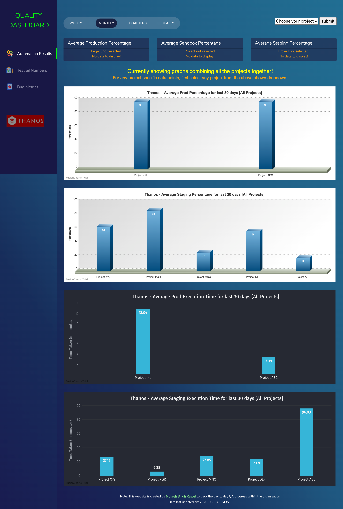
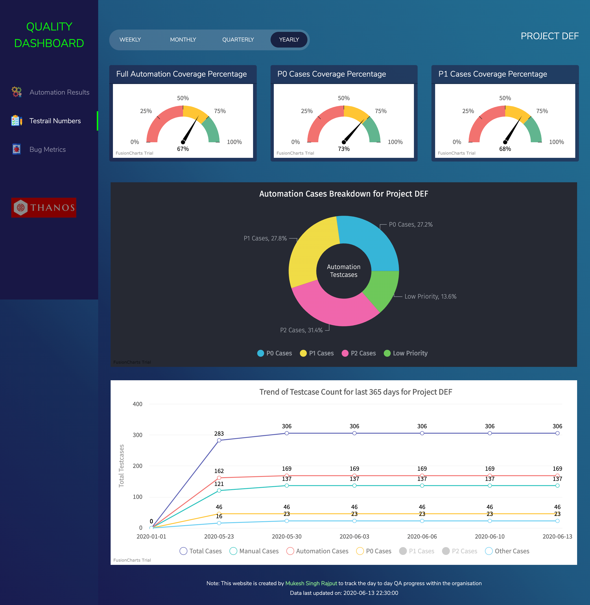
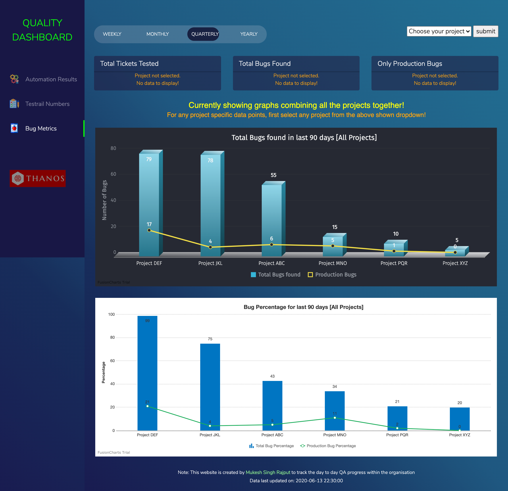
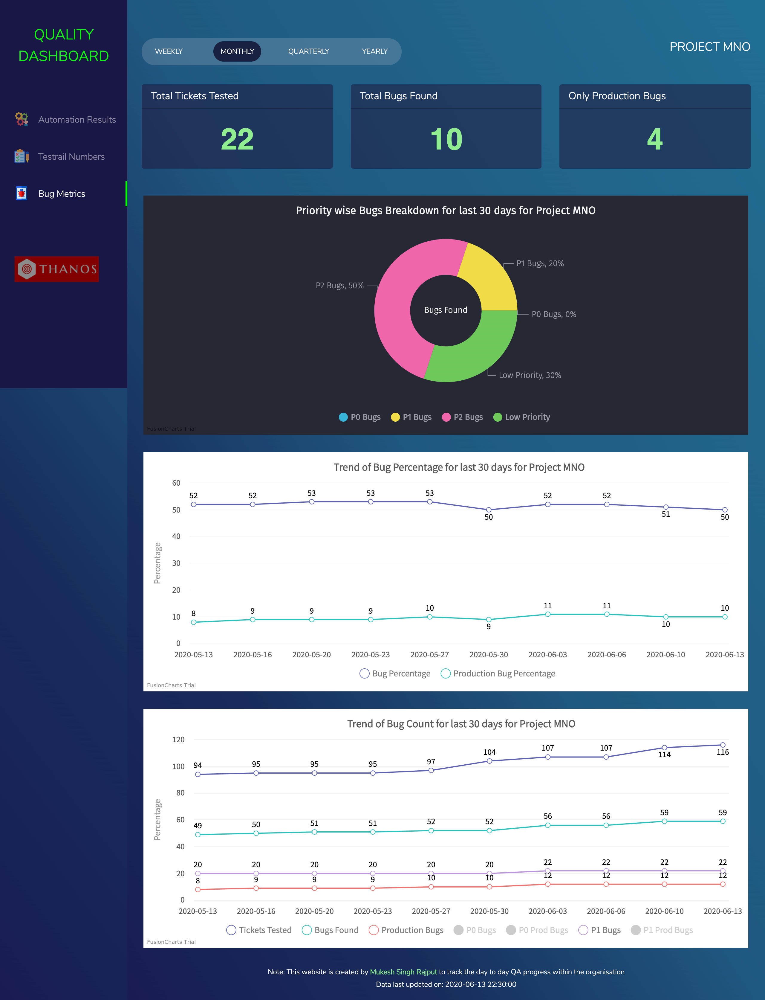

# QUALITY DASHBOARD

## Prerequisites:

#### 1. Install php server in your machine
If its Mac, php server comes installed by default, just run this cmd to start server: `php -S localhost:8282`

#### 2. Install mysql server
And then start the server using: `mysql.server start`

#### 3. Setup Database and tables
Use [this basic mysql dump file](server/mysql-dump.sql "mysql-dump.sql") to create database and insert few dummy entries, on the successful execution of this script you should get 3 tables (results, jira, testrail) created inside a database named as `thanos`

#### 4. Clone this repo in your machine
After cloning the repo, using terminal navigate to the downloaded folder path and start php server using `php -S localhost:8282`

## Start Web Server:
Start the php server and navigate to `http://localhost:8282`, you should see the home page as shown in screenshots below.

## Screenshots:

### Home Page of QA Dashboard:

### Automation Result Numbers for all the Projects:

### Automation Result Numbers for One Project:

### Testrail Numbers Page for all the Projects:

### Testrail Numbers Page for one Project:

### Bug Metrics Page for all the Projects:

### Bug Metrics Page for one Project:

## How I am populating data in mysql tables:
1. For `results table` - I have updated my automation framework to insert required data in `results` table at the end of each automation execution.

2. For `testrail table` - Don't be confused with the table name, it is not only limited to testrail numbers, but these numbers can also be fetched from any testcase management tool. I have used APIs of Testrail to fetch all the required numbers from Testrail and then inserting them in the `testrail` table twice a week.

3. For `jira table` - Again don't be confused with the table name, it is not only limited to jira numbers, but these numbers can also be fetched from any ticket management tool. I have used APIs of Jira to fetch all the required numbers from Jira and then inserting them in the `jira` table twice a week.

Point is, no matter if you insert data manually or via automation scripts, till the time you are able to add data in these 3 tables daily/weekly, your dashboard will keep showing updated data and graphs.

## Debugging:
1. Incase your mysql server is not able to execute some of the queries and showing error something like: 
`Error Code: 1055. Expression #2 of SELECT list is not in GROUP BY clause and contains nonaggregated column 'thanos.a.totalTicketsTested' which is not functionally dependent on columns in GROUP BY clause; this is incompatible with sql_mode=only_full_group_by`. 
 Then run this query in the mysql terminal or UI: `set global sql_mode='';` and start the sql connection again, please remember that if you restart the mysql server or your laptop then you might need to execute this cmd again.

2. If you are seeing `Error!: SQLSTATE[HY000] [1045] Access denied for user 'root'@'localhost' (using password: NO)` on the dashboard it means your db credentials are incorrect, you need to modify them in [this db config file](server/db-config.php "db-config.php")

## References:
This dashboard has been creating by using public services of [Fusion Charts](https://www.fusioncharts.com/).
A big Thanks to Fusion Charts team for putting such a wonderful documentation which helped me in swift integration.

## Creator:
Mukesh Rajput, For any further questions, contact [@mukesh.rajput](https://www.linkedin.com/in/mukesh-rajput)
